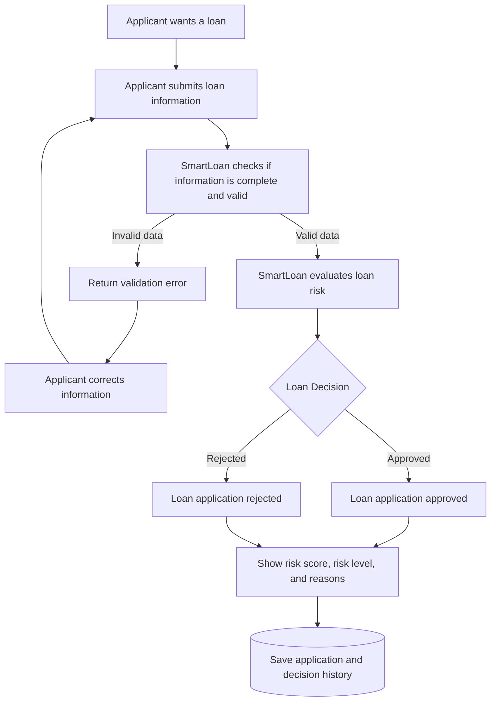

# SmartLoan Diagram 2 — Customer Journey

```mermaid
flowchart TD
    Start[Applicant wants a loan] --> Submit[Applicant submits loan information]
    Submit --> Validate[SmartLoan checks if information is complete and valid]

    Validate -->|Invalid data| Error[Return validation error]
    Error --> Fix[Applicant corrects information]
    Fix --> Submit

    Validate -->|Valid data| Evaluate[SmartLoan evaluates loan risk]
    Evaluate --> Decision{Loan Decision}

    Decision -->|Approved| Approved[Loan application approved]
    Decision -->|Rejected| Rejected[Loan application rejected]

    Approved --> Reasons[Show risk score, risk level, and reasons]
    Rejected --> Reasons

    Reasons --> Save[(Save application and decision history)]
```