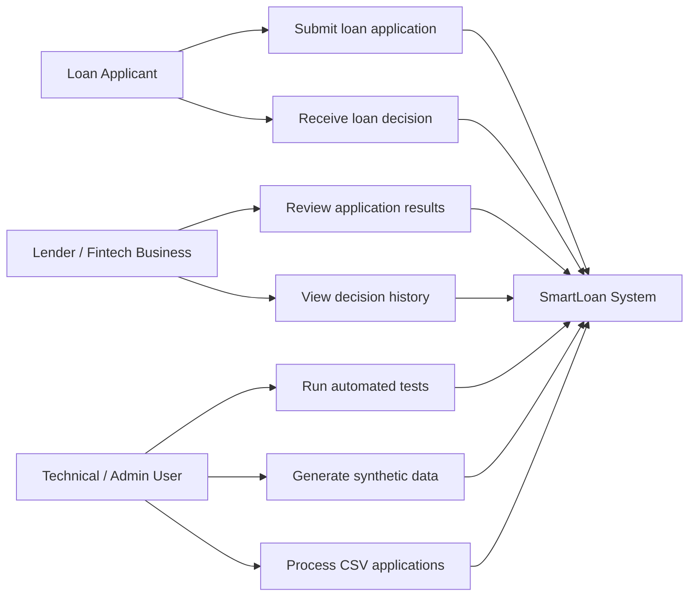

# SmartLoan Diagram 3 — Use Case Diagram

```mermaid
flowchart LR
    Applicant[Loan Applicant]
    Business[Lender / Fintech Business]
    Admin[Technical / Admin User]

    SmartLoan[SmartLoan System]

    Applicant --> Submit[Submit loan application]
    Applicant --> Receive[Receive loan decision]

    Business --> Review[Review application results]
    Business --> History[View decision history]

    Admin --> Test[Run automated tests]
    Admin --> Data[Generate synthetic data]
    Admin --> Batch[Process CSV applications]

    Submit --> SmartLoan
    Receive --> SmartLoan
    Review --> SmartLoan
    History --> SmartLoan
    Test --> SmartLoan
    Data --> SmartLoan
    Batch --> SmartLoan
```