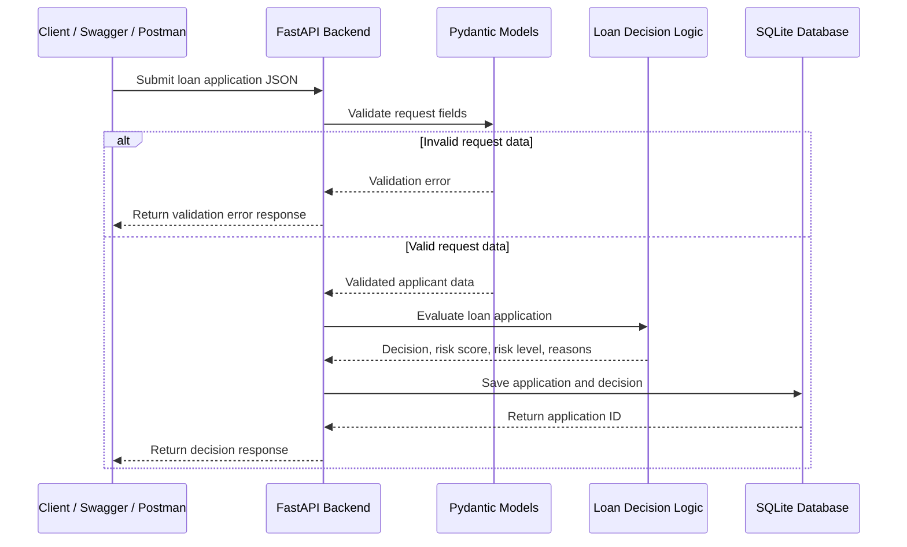

# SmartLoan Diagram 4 — API Sequence Diagram

```mermaid
sequenceDiagram
    participant Client as Client / Swagger / Postman
    participant API as FastAPI Backend
    participant Models as Pydantic Models
    participant Logic as Loan Decision Logic
    participant DB as SQLite Database

    Client->>API: Submit loan application JSON
    API->>Models: Validate request fields

    alt Invalid request data
        Models-->>API: Validation error
        API-->>Client: Return validation error response
    else Valid request data
        Models-->>API: Validated applicant data
        API->>Logic: Evaluate loan application
        Logic-->>API: Decision, risk score, risk level, reasons
        API->>DB: Save application and decision
        DB-->>API: Return application ID
        API-->>Client: Return decision response
    end
```