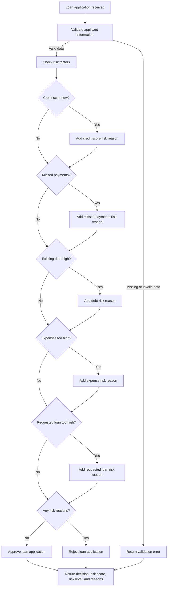

# SmartLoan Diagram 5 — Decision Flow Diagram

```mermaid
flowchart TD
    Start[Loan application received] --> Validate[Validate applicant information]

    Validate -->|Missing or invalid data| ValidationError[Return validation error]

    Validate -->|Valid data| CheckRisk[Check risk factors]

    CheckRisk --> Credit{Credit score low?}
    Credit -->|Yes| AddCreditRisk[Add credit score risk reason]
    Credit -->|No| Missed{Missed payments?}

    AddCreditRisk --> Missed

    Missed -->|Yes| AddMissedRisk[Add missed payments risk reason]
    Missed -->|No| Debt{Existing debt high?}

    AddMissedRisk --> Debt

    Debt -->|Yes| AddDebtRisk[Add debt risk reason]
    Debt -->|No| Expenses{Expenses too high?}

    AddDebtRisk --> Expenses

    Expenses -->|Yes| AddExpenseRisk[Add expense risk reason]
    Expenses -->|No| LoanAmount{Requested loan too high?}

    AddExpenseRisk --> LoanAmount

    LoanAmount -->|Yes| AddLoanRisk[Add requested loan risk reason]
    LoanAmount -->|No| FinalDecision{Any risk reasons?}

    AddLoanRisk --> FinalDecision

    FinalDecision -->|No| Approved[Approve loan application]
    FinalDecision -->|Yes| Rejected[Reject loan application]

    Approved --> Response[Return decision, risk score, risk level, and reasons]
    Rejected --> Response
    ValidationError --> Response
```