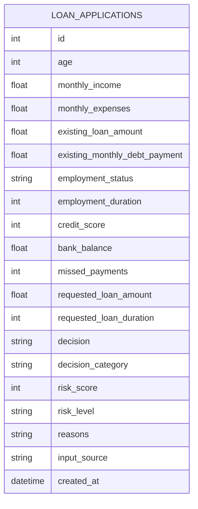

# SmartLoan Diagram 6 — Database ERD Diagram

```mermaid
erDiagram
    LOAN_APPLICATIONS {
        int id
        int age
        float monthly_income
        float monthly_expenses
        float existing_loan_amount
        float existing_monthly_debt_payment
        string employment_status
        int employment_duration
        int credit_score
        float bank_balance
        int missed_payments
        float requested_loan_amount
        int requested_loan_duration
        string decision
        string decision_category
        int risk_score
        string risk_level
        string reasons
        string input_source
        datetime created_at
    }
```