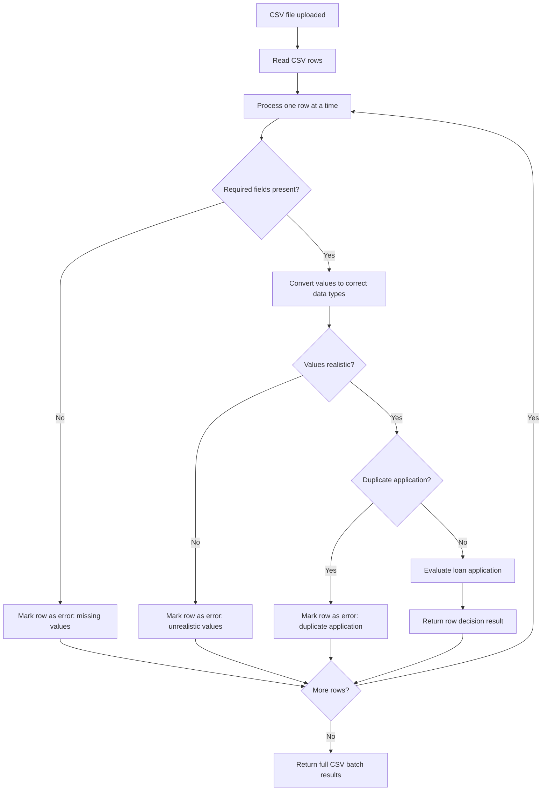

# SmartLoan Diagram 7 — CSV Processing Flow

```mermaid
flowchart TD
    Start[CSV file uploaded] --> Read[Read CSV rows]
    Read --> Row[Process one row at a time]

    Row --> Required{Required fields present?}
    Required -->|No| Missing[Mark row as error: missing values]
    Required -->|Yes| Convert[Convert values to correct data types]

    Convert --> Unrealistic{Values realistic?}
    Unrealistic -->|No| Invalid[Mark row as error: unrealistic values]
    Unrealistic -->|Yes| Duplicate{Duplicate application?}

    Duplicate -->|Yes| DuplicateError[Mark row as error: duplicate application]
    Duplicate -->|No| Evaluate[Evaluate loan application]

    Evaluate --> Result[Return row decision result]

    Missing --> NextRow{More rows?}
    Invalid --> NextRow
    DuplicateError --> NextRow
    Result --> NextRow

    NextRow -->|Yes| Row
    NextRow -->|No| Summary[Return full CSV batch results]
```