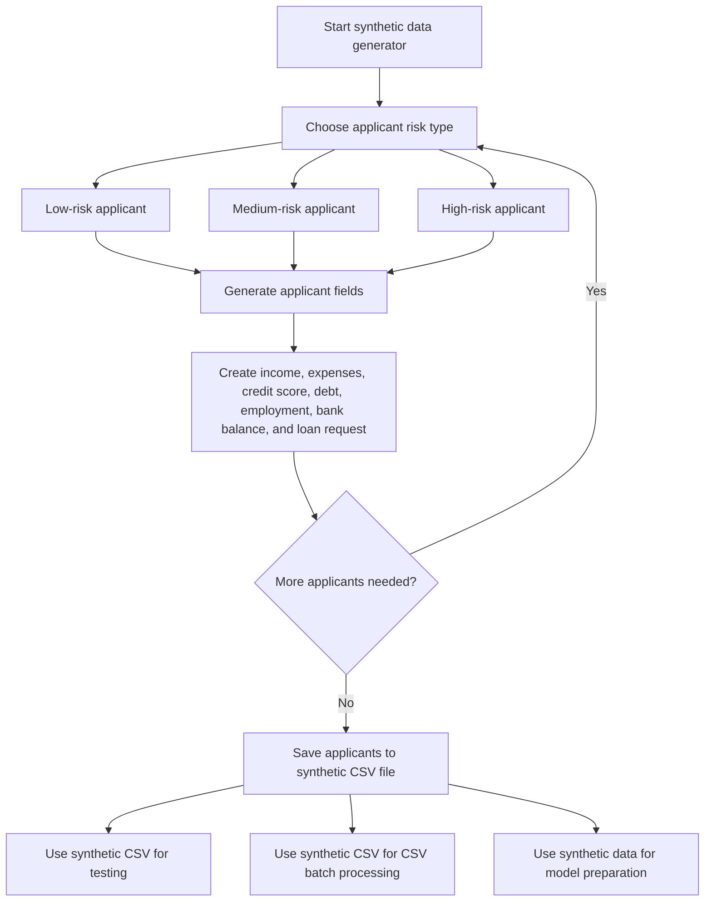

# SmartLoan Diagram 8 — Synthetic Data Flow

```mermaid
flowchart TD
    Start[Start synthetic data generator] --> Type[Choose applicant risk type]

    Type --> Low[Low-risk applicant]
    Type --> Medium[Medium-risk applicant]
    Type --> High[High-risk applicant]

    Low --> Generate[Generate applicant fields]
    Medium --> Generate
    High --> Generate

    Generate --> Fields[Create income, expenses, credit score, debt, employment, bank balance, and loan request]

    Fields --> Repeat{More applicants needed?}
    Repeat -->|Yes| Type
    Repeat -->|No| CSV[Save applicants to synthetic CSV file]

    CSV --> Test[Use synthetic CSV for testing]
    CSV --> Batch[Use synthetic CSV for CSV batch processing]
    CSV --> ML[Use synthetic data for model preparation]
```