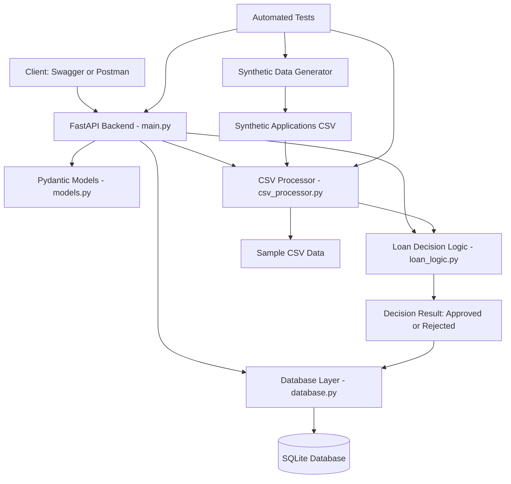

# SmartLoan Diagram 9 — Current Backend Architecture

```mermaid
flowchart TD
    Client[Client: Swagger or Postman] --> API[FastAPI Backend - main.py]

    API --> Models[Pydantic Models - models.py]
    API --> Logic[Loan Decision Logic - loan_logic.py]
    API --> CSV[CSV Processor - csv_processor.py]
    API --> DB[Database Layer - database.py]

    CSV --> SampleCSV[Sample CSV Data]
    CSV --> Logic

    Generator[Synthetic Data Generator] --> SyntheticCSV[Synthetic Applications CSV]
    SyntheticCSV --> CSV

    Logic --> Decision[Decision Result: Approved or Rejected]
    Decision --> DB

    DB --> SQLite[(SQLite Database)]

    Tests[Automated Tests] --> API
    Tests --> CSV
    Tests --> Generator
```